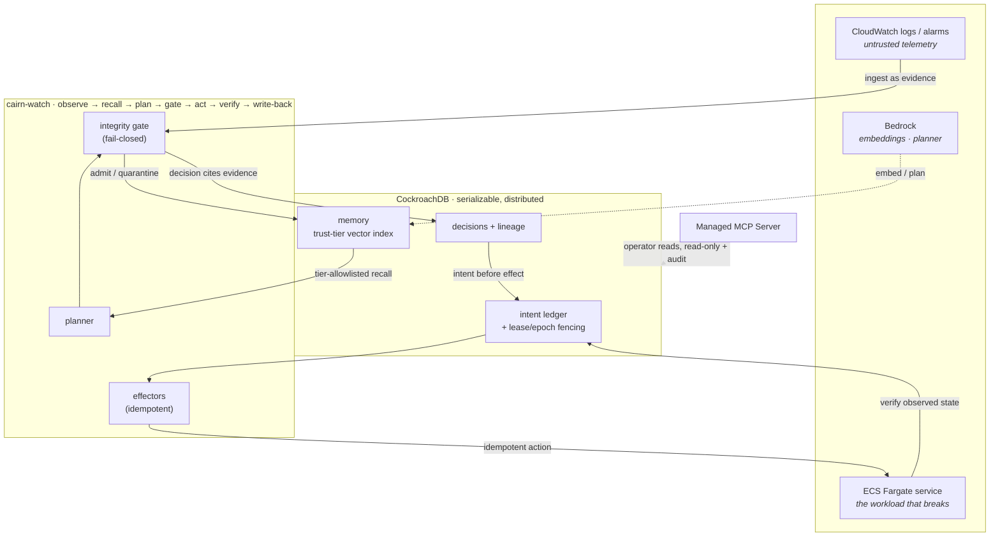

# Cairn

**Transactional, provenance-stamped memory for agents that take actions.**

A cairn is a stack of stones marking a trail — each one placed so you can find your way back. That
is what this does for an agent: every step it takes becomes a durable marker you can walk back
along, and every fact it learns carries a record of where it came from.

> **The trail that's still standing when you get back.** Cairn is the agent memory you can trust
> when things are on fire — durable through the very outage it's fixing, and un-poisonable by the
> logs it reads.

Built for the **CockroachDB × AWS "Build with Agentic Memory"** hackathon.

---

## The problem

An agent that only *talks* can forget safely. An agent that *acts* cannot. Two things go wrong in
production, and both are memory problems:

1. **The memory dies with the incident.** An agent remediating a failing service keeps its plan and
   its progress somewhere inside the same blast radius. When the worker dies mid-run, the run is
   either abandoned half-applied or replayed into duplicate side effects.
2. **The memory is attacker-writable.** An agent that ingests logs, alerts, and tickets into
   long-term memory has handed everyone who can write to those sources a write path into its own
   future context. Poison it once, influence every run afterward.

Cairn treats both as first-class, and it does so in a way that is **only possible on a distributed,
serializable database** — which is the whole point.

## Three mechanisms, each load-bearing on CockroachDB

### 1 · A write-ahead intent ledger — durable, exactly-once execution
Every side effect is preceded by an intent committed under `SERIALIZABLE`, carrying a deterministic
idempotency key and a lease. A worker that dies mid-step leaves an unambiguous record; another
worker claims the lapsed lease and finishes, and the idempotency key makes the re-run a no-op at the
effector. **Why CockroachDB:** the ledger has to be readable while the region running the agent is
degraded. A single-node Postgres ledger is unavailable exactly when it matters. Proven by killing a
node mid-remediation and watching the run finish, exactly once — verified against real external
state, not a self-reported counter.

### 2 · A trust-tier-partitioned vector index — memory as a trust boundary
Every memory row carries a trust tier, and that tier is a **prefix column of the vector index**.
Retrieval names the tiers it accepts as an allowlist, and CockroachDB scopes the
approximate-nearest-neighbour traversal to exactly those tiers — quarantined memory is not filtered
out of a result set, it is **never visited**. pgvector cannot express this; it post-filters (recall
collapses, the poisoned vectors are still walked). This is the single most contest-specific
mechanism, and it maps onto the sponsor's flagship feature.

### 3 · Recall and decision commit in one transaction — a real invariant
The planner's retrieval, the decision, and its evidence edges commit together. A fact revoked
concurrently cannot slip between the read and the write: the two transactions touch the same rows,
so the cluster forces one to retry. **No decision is ever committed citing evidence a concurrent
transaction has revoked** — the property the sponsor calls impossible where the vector index and the
operational tables are not in the same transaction.

Plus **provenance rollback**: revoking a fact walks its lineage (`memory → decision → step`), taints
every decision downstream, and proposes compensating actions for what already ran. "What did we do
because we believed this lie?" is a query, not an investigation.

## Architecture



## Which CockroachDB tools — and what the agent does with each

Three of the four (two required):

| Tool | What Cairn does with it |
|---|---|
| **Distributed Vector Indexing** | The load-bearing mechanism: a `VECTOR INDEX (tenant, trust_tier, embedding)` where the trust tier is a prefix column, so semantic recall is physically scoped to trusted strata and quarantined memory is unreachable. `EXPLAIN` in the tests confirms one prefix span per allowed tier. |
| **Managed MCP Server** | The operator's read-only, RBAC-scoped, audit-logged window into the agent's live memory, over `cockroachlabs.cloud/mcp`. Proven end to end in [`lab/managed_mcp_inspect.py`](lab/managed_mcp_inspect.py) — see [`docs/managed-mcp.md`](docs/managed-mcp.md). |
| **Agent Skills Repo** | Two portable skills encode the durable-execution and untrusted-memory disciplines on CockroachDB primitives ([`skills/`](skills/)), shipped in-repo and **contributed upstream** to `cockroachlabs/cockroachdb-skills` (PR [#22](https://github.com/cockroachlabs/cockroachdb-skills/pull/22)). |

## Which AWS services — and what the agent does with each

| Service | Role |
|---|---|
| **Bedrock** | Titan Text Embeddings V2 turns memory into the vectors the trust-tier index searches; the planner and gate second-opinion use the Converse API. Model-agnostic via [`bedrock.py`](src/cairn/bedrock.py); the reproducible demo falls back to a local ONNX embedder so it runs with zero credentials. |
| **ECS Fargate** | The `checkout-api` workload the agent remediates — scaled and rolled back through idempotent effectors. The zero-credential demo simulates it deterministically for replay; the effector contract is the same against the real ECS API. |
| **CloudWatch** | The untrusted telemetry source — logs and alarms the agent ingests as *evidence, never instructions*. |

## Run it

**Zero credentials, one command** (the reviewer path):

```bash
docker compose -f docker-compose.demo.yml up --build
# open http://localhost:8080 and press "Run incident"
```

This brings up a single-node CockroachDB and the console together; nothing leaves your machine.

**Local development** (the multi-region lab + tests):

```bash
docker compose -f lab/docker-compose.yml up -d          # 3 nodes, one per region
uv venv && uv pip install -e ".[dev,mcp,embed]"
uv run pytest                                           # 38 tests, against the live cluster
uv run python -m cairn.eval.runner                      # the graded gate scorecard
uv run python lab/resilience.py                         # kill a region mid-run; watch it finish
```

## Proof, not assertion

- **38 tests** run against a real CockroachDB cluster — including a chaos test that kills a worker
  in the worst window (after the effect, before the result) with a real `os._exit` and asserts each
  effect lands exactly once.
- **Graded evaluation** of the integrity gate against a held-out corpus of 33 injections across 12
  families plus 16 benign look-alikes: **82% recall with deterministic detectors alone, 0% false
  positives**, and the misses are published — all six are pure semantic paraphrase, the exact gap
  the model second-opinion closes and which fails closed when the model is unavailable.
- **Region-failure demo**: a node is killed mid-remediation; the worker fails over to a surviving
  region, reads its intact ledger, and finishes — exactly once.

## Honest limitations

- Bedrock text-generation inference is gated on the fresh AWS account used here ("Operation not
  allowed", pending a support case), so the reproducible demo uses a local embedder and a
  deterministic planner. Every model call sits behind an interface and swaps to Bedrock via one env
  var once enabled.
- The zero-credential demo simulates the ECS workload for deterministic replay. The effector
  contract is idempotent and API-shaped, so the same steps drive a real ECS service unchanged.
- The gate's deterministic detectors do not catch pure semantic paraphrase on their own — that is
  the model second-opinion's job, and the default is fail-closed.

## License

MIT — see [LICENSE](LICENSE).
